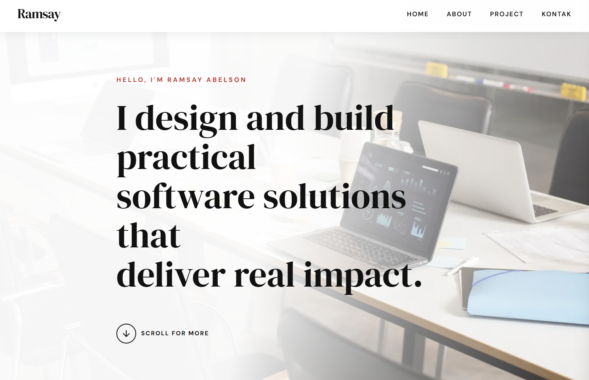
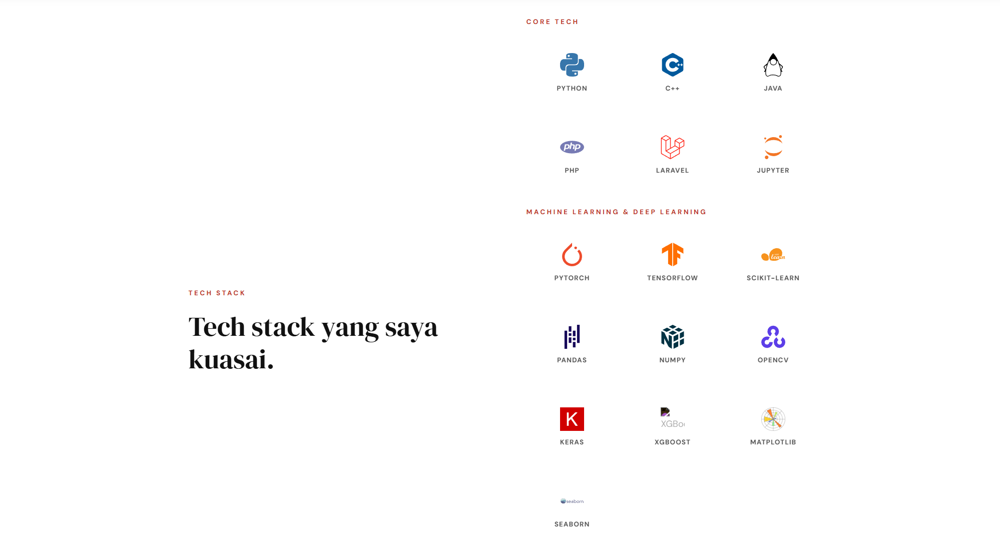
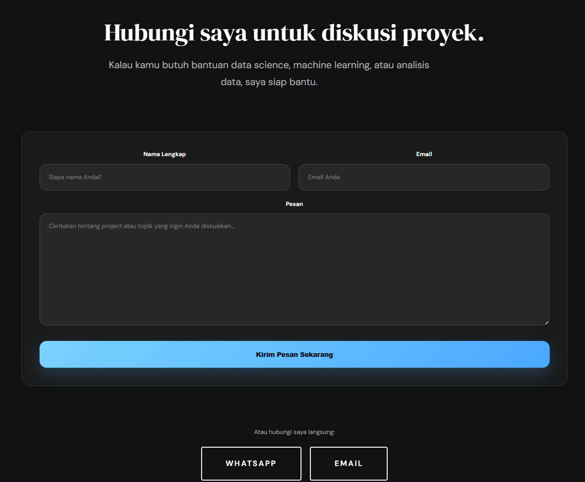
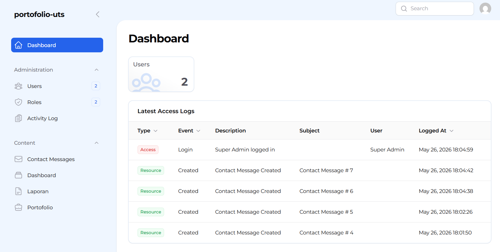

| Nama           | Ramsay Abelson                      |
| -------------- | ----------------------------------- |
| NIM            | 20240801042                         |
| Mata Kuliah    | Pemrograman Web (CR002)             |
| Dosen Pengampu | Jefry Sunupurwa Asri, S.Kom., M.Kom |
| Program Studi  | Teknik Informatika                  |
| Universitas    | Universitas Esa Unggul              |

<p>
  <a href="docs/LAPORAN-AWAL-PROJECT-AKHIR.pdf">
    
  </a>
</p>

## Portofolio UTS

Website portofolio responsif yang dibuat sebagai pemenuhan tugas UTS. Project ini menampilkan profil, daftar project, form kontak dinamis, halaman laporan awal project akhir, serta panel admin untuk mengelola konten.

## Fitur Utama

### 1. Website Portofolio

- **Home ( / )**: Menampilkan profil profesional, bio singkat, dan stack keahlian.
- **Showcase ( / Project )**: Menampilkan daftar project yang pernah atau sedang dibuat.
- **Contact**: Form kontak dinamis yang tersimpan ke database.

### 2. Laporan Awal Project Akhir

- **Halaman Laporan Dinamis**: Data laporan diambil dari tabel `laporan`.
- **Judul Project & Deskripsi Singkat**: Menjelaskan solusi yang ditawarkan oleh project Chess War.
- **Analisis Masalah & Kebutuhan Sistem**: Menjelaskan latar belakang, kebutuhan, dan fitur utama.
- **Arsitektur & Tech Stack**: Menjelaskan teknologi yang digunakan seperti Laravel, Blade, Tailwind CSS, JavaScript, Docker, Nginx, dan MariaDB.
- **Rencana Perancangan Diagram**: Menampilkan diagram ERD, Flowchart, dan Use Case langsung di halaman web.
- **Link PDF Laporan**: README dan halaman laporan menyediakan tautan ke file PDF laporan awal project akhir.

### 3. Implementasi Teknis

- **MVC / Modern Framework**: Dibangun menggunakan Laravel dengan pola Model, View, dan Controller.
- **Database Dinamis**: Menggunakan MariaDB untuk menyimpan data portofolio, kontak, dan laporan.
- **CRUD Panel Admin**: Panel admin dapat digunakan untuk mengelola data:
  - Portofolio
  - Laporan
  - Contact Messages
- **Seeder Data Awal**: Data awal project, laporan, user admin, role, dan pesan kontak disiapkan melalui Laravel Seeder.
- **Source Code GitHub**: Source code dipush ke repository GitHub dan menyertakan file PDF laporan di folder `docs/`.

## Akses Admin

Panel admin dapat diakses melalui:

```text
https://portofolio-uts.test/admin
```

Default akun admin:

```text
Email: admin@admin.com
Password: password
```

## Endpoint Utama

```text
Home / About      : https://portofolio-uts.test/
Portofolio        : https://portofolio-uts.test/portofolio
Laporan Project   : https://portofolio-uts.test/laporan
Contact           : https://portofolio-uts.test/contact
Panel Admin       : https://portofolio-uts.test/admin
PDF Laporan       : docs/LAPORAN-AWAL-PROJECT-AKHIR.pdf
```

## Teknologi

- Laravel
- Filament Admin Panel
- Blade Template
- Tailwind CSS
- JavaScript
- MariaDB
- Docker
- Nginx

## Panduan Instalasi

### 1. Persyaratan

- PHP 8.2+
- Composer
- Node.js dan npm
- Docker dan Docker Compose

### 2. Setup Project

```bash
git clone <url-repository>
cd portofolio-uts
cd src
composer install
npm install
```

### 3. Konfigurasi Environment

```bash
cp .env.example .env
php artisan key:generate
```

Sesuaikan koneksi database di file `.env` jika tidak memakai Docker.

### 4. Jalankan Migration dan Seeder

```bash
php artisan migrate --seed
```

### 5. Jalankan Aplikasi

```bash
npm run dev
php artisan serve
```

Jika memakai Docker, jalankan `docker compose up -d --build` sesuai konfigurasi yang tersedia di root project.

## Panduan Kontribusi

Jika ingin berkontribusi pada project ini, ikuti alur berikut:

1. Fork repository ini.
2. Buat branch baru untuk perubahan kamu.
3. Kerjakan perubahan dengan rapi dan konsisten dengan gaya kode yang sudah ada.
4. Jalankan pengujian atau validasi yang relevan sebelum membuat pull request.
5. Kirim pull request dengan penjelasan singkat mengenai perubahan.

## Screenshot / Demo

Screenshot demo tersedia di folder `src/public/screenshot_demo`.

### Landing Page



### Skill Stack



### Contact Form



### Admin Panel



## Lisensi

Project ini menggunakan lisensi MIT. Silakan gunakan, modifikasi, dan distribusikan sesuai ketentuan lisensi tersebut.
